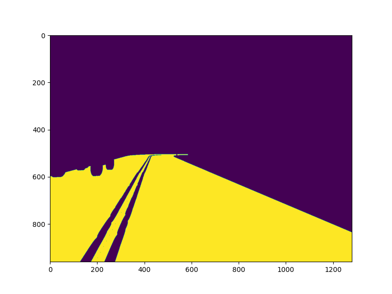

# Environment Perception For Self-Driving Cars

How can we implement an environment perception stack for self-driving cars?

We will ...

Use the output from semantic segmentation neural networks to:

- implement drivable space estimation in 3D;
- implement lane estimation;
- filter out unreliable estimates in the output of 2D object detectors.

Use the filtered 2D object detection output to determine how far obstacles are from the self-driving car.

**Input:**

| Input Image                 | Depth Image                 | Segmented Image                 | Colored Segmented Image                 |
| --------------------------- | --------------------------- | ------------------------------- | --------------------------------------- |
|  |  |  |  |

## Step 1 : Drivable Space Estimation in 3D

Input: Output of a semantic segmentation neural networks.

### Step 1.1 - Estimating the x, y, and z coordinates of every pixel in the image

### Step 1.2 - Estimating The Ground Plane Using [RANSAC](https://homepages.inf.ed.ac.uk/rbf/CVonline/LOCAL_COPIES/FISHER/RANSAC/)

1. We need to process the semantic segmentation output to extract the relevant pixels belonging to the class you want consider as ground. For this project the **road** class as a **mapping index of 7.**

2. Use the extracted x, y, and z coordinates of pixels belonging to the road to estimate the ground plane.

| Road Mask                 | Ground Plane Mask           | Ground Plane Mask 3D (point cloud) |
| ------------------------- | --------------------------- | ---------------------------------- |
|  |  |      |

We still needs to perform lane estimation to know where it is legally allowed to drive.

## Step 2 : Lane Estimation Using The Semantic Segmentation Output

### Step 2.1 - Estimate Lane Boundary Proposals

We can estimate any line that qualifies as a lane boundary (line proposals) using the output from semantic segmentation.

1. Create an image containing the semantic segmentation pixels belonging to categories relevant to the lane boundaries.
   - Pixels of Lane Markings: 6
   - Pixels of Side Walks: 8.
2. Perform edge detection on the derived lane boundary image. `cv2.Canny()`
3. Perform line estimation on the output of edge detection. `cv2.HoughLinesP()`

### Step 2.2 - Merge and Filter Lane Lines
