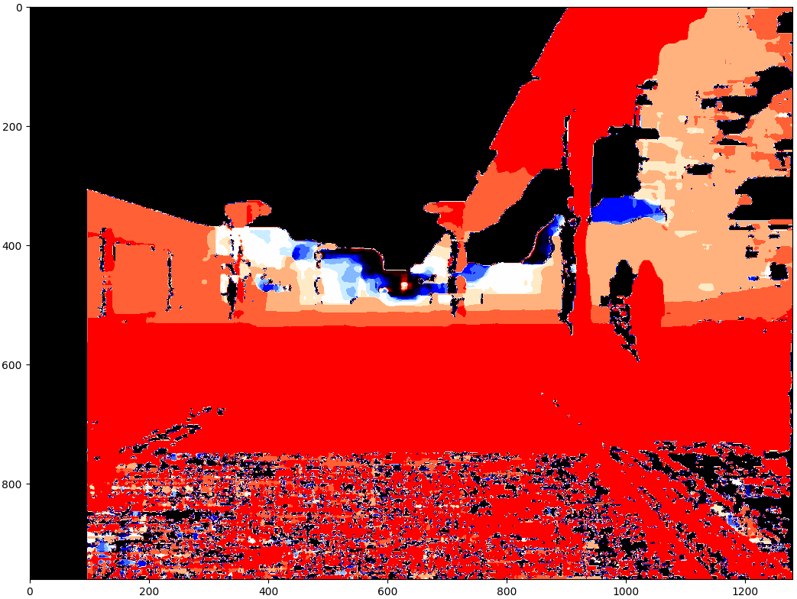

# Applying Stereo Depth to a Driving Scenario

Use Stereo Depth for finding the distance to collision with an obstacle.
In this scenario the obstacle is a motorcycle.

### Purpose of assignment:

- Lear how to use OpenCV.
- Understand the process of obtaining depth from a pair of stereo images.
- Understand the advantages of cross-correlation for localization of important information in an image.

## Prerequisites

Install the following:

- numpy
- matplotlib
- opencv-python

## Steps:

### Step 1 - Setup

- Load a pair of stereo images
- Get calibration matrices of each image

### Step 2 - Estimate Depth

- Computing the Disparity
  - There are two OpenCV functions that we can use to compute a disparity map [StereoBM](https://docs.opencv.org/3.4.3/d9/dba/classcv_1_1StereoBM.html) and [StereoSGBM](https://docs.opencv.org/3.4.3/d2/d85/classcv_1_1StereoSGBM.html), they are called the matcher.
  - After choosing the matcher we can use the [`compute`](https://docs.opencv.org/3.4.3/d2/d6e/classcv_1_1StereoMatcher.html#a03f7087df1b2c618462eb98898841345) function to generate the disparity. (:warning: `compute` can only be applied to a gray scale image)

- Decompose the projection matrices into intrinsic (`K`) and extrinsic (`R` and `t`) matrices
  - For this [`cv2.decomposeProjectionMatrix()`](https://docs.opencv.org/3.4.3/d9/d0c/group__calib3d.html#gaaae5a7899faa1ffdf268cd9088940248) can be used.
- Generate the depth map
  - Get focal length `f` from Camera matrix ([Dissecting the Camera Matrix](http://ksimek.github.io/2013/08/13/intrinsic/))
  - Compute the baseline `b` (distance between left and right camera)
  - Compute the depth map
    - depth_map = (f \* b)/disparity

### Step 3 - Finding the distance to collision

- Normally now we would run an object detector that has been trained to select a rectangular section containing the object we are concerned about. Here we have already the objected identified which is provided by the function `get_obstacle_image` from `files_management` script.
- Now we need to find this object in our scene, for this we use **Cross Correlation**.

  - first we get the cross correlation heat map with [`cv2.minMaxLoc()`](https://docs.opencv.org/3.4.3/d2/de8/group__core__array.html#ga8873b86a29c5af51cafdcee82f8150a7)
  - then we get the obstacle position from that map with [`cv2.minMaxLoc()`](https://docs.opencv.org/3.4.3/d2/de8/group__core__array.html#ga8873b86a29c5af51cafdcee82f8150a7)

- Lastly we will crop the section of the depth map that corresponds to the obstacle and find the nearest point in that crop.
- We can also place a bounding box to highlight the object in the input image

**With all of this we get that the object is:**

> 7.817
